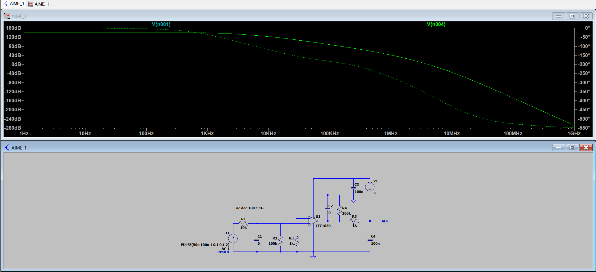

# Smart Device Project: Nanoparticle Gas Sensor & IoT Shield
**UF "Smart Devices" – PTP Innovative Smart System (ISS)**

## 1. Project Overview
This project is part of the **5ISS program at INSA Toulouse**. It focuses on the development of a **nanoparticle-based gas sensing system**, designed and characterized at **AIME**, the INSA Toulouse laboratory.

The project covers the full development cycle, from sensor fabrication to data visualization. A custom **PCB** was designed, and **ESP32 firmware** was developed to exploit the gas sensor measurements and transmit the data wirelessly. The collected data is then processed and displayed on a **web-based interface**.

The system relies on **LoRa communication** for long-range data transmission and integrates both hardware and software components.

The development chain consists of :

- Hardware design (analog signal amplified through a 2-stage transimpedance amplifier tested with LTSpice and PCB design with Kicad),

- Embedded software development using Arduino,

- LoRa wireless communication,

- Data processing and visualization using Node-RED,

- Mobile application development using MIT App Inventor.

## 2. The Measurement Chain
### Nanoparticle Gas Sensor (AIME)
Developed during a training period at AIME, this sensor utilizes:
* **Synthesis**: Nanoparticles produced and deposited by dielectrophoresis.
* **Active Zone**: A sensitive layer of $WO_3$ nanoparticles integrated on aluminum interdigitated combs.
* **Target Gases**: High sensitivity to Ethanol and Ammonium.
* **Control**: Features an internal poly-silicon heating resistor and an aluminum temperature sensor.

### Analog Interface Circuit
The sensor is interfaced via a transimpedance circuit designed to measure its resistance.
* **Amplification**: Utilizes an LTC1050 precision chopper amplifier.
* **Filtering**: A low-pass filter is implemented to extract useful signals before the ADC stage.
* **Simulation**: The circuit was validated using LTSpice IV.

---

## 3. Hardware Design (KiCad)
The PCB shield was designed following specific technical constraints to ensure compatibility with an Arduino UNO.

### Design Constraints:
* **Track Width**: 0.5 mm minimum.
* **Track Isolation**: 0.5 mm minimum.
* **Drill Sizes**: 1mm for headers/connectors; 0.8mm for passive components.

### Schematic & Routing

### 3D Model

---

## 4. Implementation & Software
* **Microcontroller**: Programmed for Arduino UNO / ESP32 platforms.
* **Connectivity**: Configured to send data over the The Things Network (TTN) via LoRa.
* **Version Control**: Developed collaboratively using Git and GitHub.

## 5. Repository Structure
* `/PCB_Capteur`: Schematic and Layout design files.
* `/Software`: Arduino/ESP32 source code for data acquisition.
* `/Spice`: Simulation files for the analog interface.
* `/Images`: Screenshots and documentation assets.

## 6. Authors & Credits
* **Student**: Tom Lassalle, Sandra Benjaoui, Louis Rousset
* **Supervisors**: J. Grisolia, A. Biganzoli, C. Crouzet, B. Mestre.
* **Partners**: AIME Toulouse (Atelier Interuniversitaire de Micro-nano Électronique).
